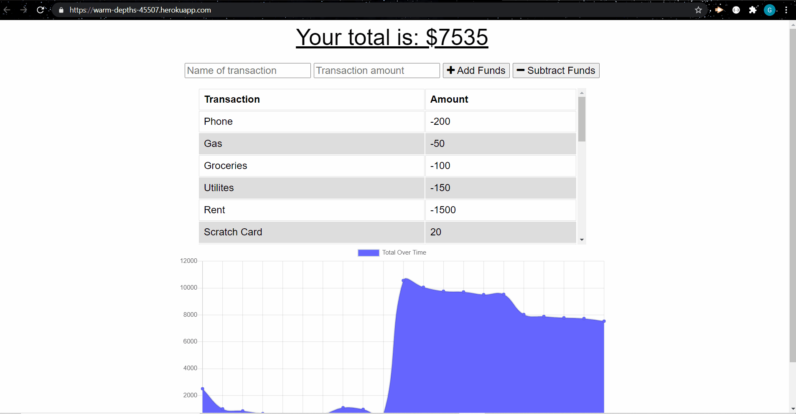

# Budget Tracker

 ## Table of contents
  ---
  [Description](#description)

  [Usage](#usage)

  [Contributing](#contributing)

  [Questions](#questions)

  [License](#license)

## Description

This is a budget tracking application that can save submitted transactions while offline to be stored and downloaded when the application regains connectivity.

## Usage

Navigate to the [deployed website](https://warm-depths-45507.herokuapp.com/) and follow the usage video below:

## Technologies

This application utilizes:
* HTML, CSS and Javascript
* Bootstrap
* MongoDB with Mongoose
* ExpressJS with Node
* IndexedDB for offline storage

## Contributing
  Please note that this project is released with a Contributor Code of Conduct. By participating in this project you agree to abide by its terms.
  
  ## Questions
  [GitHub Repository](https://github.com/Geoff7709/indexedDb_budget_trkr)

  For further questions please feel free to email the developers:

  geoffzimmerman23@gmail.com
  ## License
  Use of this software is regulated under the following lisence:

  [MIT](https://opensource.org/licenses/MIT)
